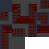

# BlazinWFC

A Wave Function Collapse implimentation in JavaScript, focusing on speed and set up for more complex tilesets.
Usage is geared towards other rendering programs like Phaser Tilemaps as it returns an array of indexs.

## Installation

Install BlazinWFC with npm

```bash
  npm install blazinwfc
```
    
## Usage

```javascript
import WFC from 'blazinwfc';
import { definition } from 'definition.js';

const wfc = new WFC(definition);
```

## Properties

```javascript
const map = wfc.collapse(50); // Collapses a 50x50 grid and returns an array of indexs

wfc.test(50, 10); // Collapses a 50x50 grid 10 times and returns the average time in seconds
```

## Definition

The definition is where you define your tiles rules and set some options for the algorithm.\
Examples can be found in the examples folder. The following is a small snippet of a definition.

```javascript
export const definition = {
    options: {
        saveInterval: 0.02, // Default 0.02
        baseWeight: 10 // Default 10
    },
    tiles: [
        { edges: ['AAA', 'AAA', 'AAA', 'AAA'], type: 'floor', exceptions: undefined, weight: 30 },
        { edges: ['BBB', 'BBB', 'BBB', 'BBB'], type: 'black', exceptions: undefined, weight: 20 },
        { edges: ['BBB', 'BCC', 'AAA', 'CCB'], type: 'wallbase', exceptions: { down: ['walltop'] } } // I later realized with the angled tilemap that wall top could actually go below wallbase but this gives an example of how exceptions should look.
    ]
}
```

You can leave the options empty for default values to be used but you still have to leave the options property in the object

**saveInterval:** This is used to determin how often a current state should be saved for rolling back the algorithm incase it gets stuck. You can run the test function and mess with this to see if you get faster results with a different percentage (0.02 == 2%). Default is 0.02./

**baseWeight:** This sets the default weight for tiles where weight is undefined.

The tiles property is where you define the tiles to be used by the algorithm.\
The tiles must be entered in the same order as your tilemap you plan to use. (Images below)

**edges:** You can think of these like sockets, they run in the order UP, RIGHT, DOWN, LEFT.

**type:** The type of the tile is used by the exceptions object.

**exceptions:** Sometimes you will run into a situation where tiles have matching sockets but should still not be placed next to each other. For example (See socket definition image below) the floor tile can go right of tile 6 and left of tile 8. So all three have 'AAA' socket but tile 8 should not go right of tile 6 so you add wall to tile 6's right exceptions and tile 8's left exceptions.

**weight:** This is where you can mess around with how high of a chance a tile should have of showing up. Default is 10.


**A closer look**

When adding the sockets to your defintion make sure to read in a clockwise direction. Compare the third tile in the above code to the socket map image below. The top socket should be entered left to right, the right socket top to bottom, the bottom socket right to left and the left socket bottom to top./
/
You can shorten sockets so 'AAA' could be just 'A' while leaving 'BCB' as needed. Watch out though for things like 'BBA' and 'BAA' don't shorten them to 'BA'. 

## Tile Socket Map


Here is how the tilemap should look for use in phaser if you're using that or another program that uses tilemaps.



A sample generation


## Examples

There are two example definitions in the examples folder and their corresponding tilemaps in the image folder.

## Speed Test

I could only really find one other JavaScript implimentation of WFC https://www.npmjs.com/package/wavefunctioncollapse

I ran speed tests and averaged the time over 1000 map generations of varing sizes. It is important to note that the other implimentation is also working with bitmap data. For the test I did parse out the bitmap loading to only happen once and not on every call to get a more fair comparison to how mine works. I also shutdown processes on my computer that could possibly spool up cpu usage durring a test.

|Test   |BlazinWFC |WaveFunctionCollapse|
|:-----:|:---------|:------------------:|
|25x25  |0.0048 Sec|0.0039 Sec          |
|50x50  |0.0197 Sec|0.0457 Sec          |
|100x100|0.1556 Sec|0.6778 Sec          |

## Comparison

**Definitions:** This is actually the reason I decided to make this package. With WaveFunctionCollapse I still cannot wrap my mind around how the definition works. I initially got the above example to work after days of bruteforcing it and when I tried to move to the angled tiles I just couldn't get them to work. It also might not be possible with a tile set that is more complex like that. I wanted to make BlazingWFC's definition more verbose and eaiser to understand. I got lucky and found coding trains video on youtube and modified how his.

**Setup:** With BlazinWFC you only have to write your definition import the package and then you can call the collapse method. Granted both packages were set up with different purposes but there is no need to set up all the other functions used by WaveFunctionCollapse. The tiles array and their rules are also set to the WFC object as soon as you instaniate in by default instead of creating that data structure every time you want to run it, though you can also set this up yourself with the other library.

**Rollback:** With BlazinWFC rollback is built in. Sometimes collapsing will end in a contradition. It is better to rollback to a previously saved state then to start over, especially with bigger maps. More complex maps will contradict more often as well. The rollback feature also allows for some of the speed gains. I was able to forgoe updating all the cells that should be updated every cycle in exchange to having to rollback more often. 


## Try it out

Coming soon

## Planned features
1. I do hope to make it even faster, if not for smaller maps at least for bigger ones. Suggestions are always welcome.
2. Multi layer support. Returning 2 or more arrays with filled in alpha tiles. This will be needed for something like the angled tile example where the wall tops need a floor piece underneath them.
3. Tile symmetry. Just to make definitions shorter.
4. Closed off room handling, with the option to either fill them in, open them up or leave them as is for further post processing and creation of hidden rooms. (ie, the walls open up when you inspect them but thats on you)
5. The map is designed to be tileable right now if there is a want I will make that optional.